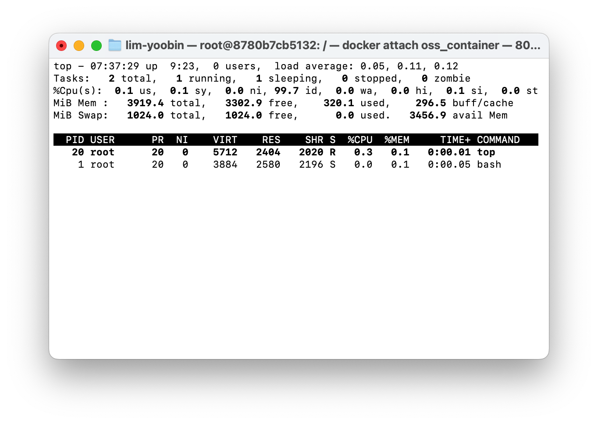

# OSS_Prac 
OSS HW-top, ps, jobs, kill에 대해 조사

### 1. top
>시스템의 상태와 실행 중인 프로레스들을 실시간으로 모니터링하는 도구
> 
>*윈도우의 작업 관리자와 유사한 역할*

#### 주요 기능
* 시스템의 가동 시간, 로드 에버리지, 메모리 사용량 등을 상단에 표시
* CPU 사용량이나 메모리 사용량을 기준으로 프로세스 정렬하여 출력 가능

#### 주요 단축키
* `q`: top 명령어 종료
* `k`: 특정 프로세스를 종료(종료할 PID를 입력해야 함)
* `c`: 명령어의 전체 경로 출력
* `Shift + p`: CPU 사용률 내림차순으로 정렬
* `Shift + m`: 메모리 사용률 내림차순으로 정렬

#### 사용 예시
```bash
# 실시간 프로세스 모니터링 시작
$ top
```
```bash
# 특정 사용자(user)의 프로세스만 확인
$ top -u user
```
#### 실행 화면


---

### 2. ps
>현재 실행 중인 프로세스의 스냅샷을 출력하는 명령어
>
>*`top`과 달리 실시간으로 갱신되지 않고, 명령어를 입력한 시점의 상태만 출력*

#### 출력 필드 설명
* **PID**: 프로세스 ID(고유 번호)
* **TTY**: 프로세스가 연결된 터미널
* **TIME**: 총 CPU 사용 시간
* **CMD**: 실행된 명령어

#### 주요 옵션
* `-e` or `-A`: 모든 프로세스 출력
* `-f`: 풀 포맷으로 상세 정보 출력(UID, PPID 등 포함)
* `aux`: BSD 스타일 옵션, 시스템의 모든 프로세스를 사용자 및 상세 정보와 함께 출력

#### 주요 옵션 비교 (System V vs BSD)
| 옵션 스타일 | 명령어 | 특징 | 주요 출력 항목 |
| :---: | :--- | :--- | :--- |
| **System V** | `ps -ef` | 부모-자식 관계 확인 용이 | `UID`, `PID`, `PPID`, `CMD` |
| **BSD** | `ps aux` | 자원(CPU, MEM) 점유율 확인 용이 | `USER`, `%CPU`, `%MEM`, `STAT` |

#### 사용 예시
```bash
# 모든 프로세스를 상세 정보와 함께 출력(System V 스타일)
$ ps -ef
```
```bash
# 모든 프로세스를 상세 정보와 함께 출력(BSD 스타일)
$ ps aux
```
```bash
# 특정 사용자의 프로세스만 확인
$ ps -u username
```
#### 실행 화면


---

### 3. jobs
>현재 쉘 세션에서 백그라운드로 실행 중이거나 중지된 작업의 목록을 출력하는 명령어

#### 관련 개념
* **Foreground**: 터미널을 차지하고 입력을 받는 상태
* **Background (`&`)**: 명령어 뒤에 `&`를 붙이면 백그라운드에서 실행
* **Job ID**: `[1]`, `[2]`와 같이 대괄호 안의 숫자로 표시, `kill`이나 `fg` 명령에서 사용

#### 관련 명령어
* `fg %1`: 작업 번호 1번을 포그라운드(화면 앞)로 가져옵니다.
* `bg %1`: 중지된 작업 번호 1번을 백그라운드에서 계속 실행합니다.
* `Ctrl + z`: 현재 실행 중인 작업을 일시 중지하고 백그라운드로 보냅니다.

#### 사용 예시
```bash
$ sleep 100 & # 백그라운드에서 100초간 대기
$ jobs        # 목록 확인
[1]+  Running                 sleep 100 & # 실행 결과
```

#### 실행 화면


---

### 4. kill
>특정 프로세스에 시그널을 보내는 명령어
>
>*주로 프로세스를 종료할 때 사용, 일시 중지나 재개 등의 신호도 전송 가능*

#### 주요 시그널
* **SIGTERM (15)**: 기본값, 프로세스에게 종료 요청(정상 종료 유도)
* **SIGKILL (9)**: 프로세스를 강제 종료, 저장되지 않은 데이터가 유실될 수 있음(최후의 수단)
* **SIGINT (2)**: 인터럽트 신호, `Ctrl + c`와 동일

#### 주요 시그널 강도 비교
| 번호 | 이름 | 설명 | 강도 |
| :---: | :---: | :--- | :---: |
| **15** | `SIGTERM` | 정상 종료 요청(기본값) | 약함 |
| **9** | `SIGKILL` | 강제 종료(즉시 소멸) | **강함** |
| **2** | `SIGINT` | 인터럽트(Ctrl + C 와 동일) | 중간 |

#### 사용 예시
```bash
# PID가 1234인 프로세스에 종료 요청(SIGTERM)
$ kill 1234
```
```bash
# PID가 1234인 프로세스 강제 종료(SIGKILL)
$ kill -9 1234
```
```bash
# jobs 명령어로 확인한 작업 번호 1번 종료
$ kill %1
```

#### 실행 화면

